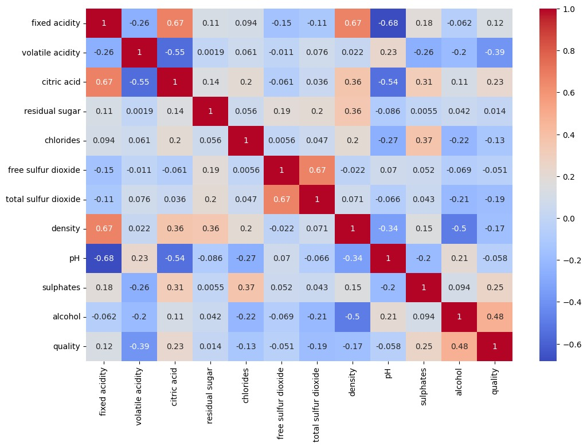
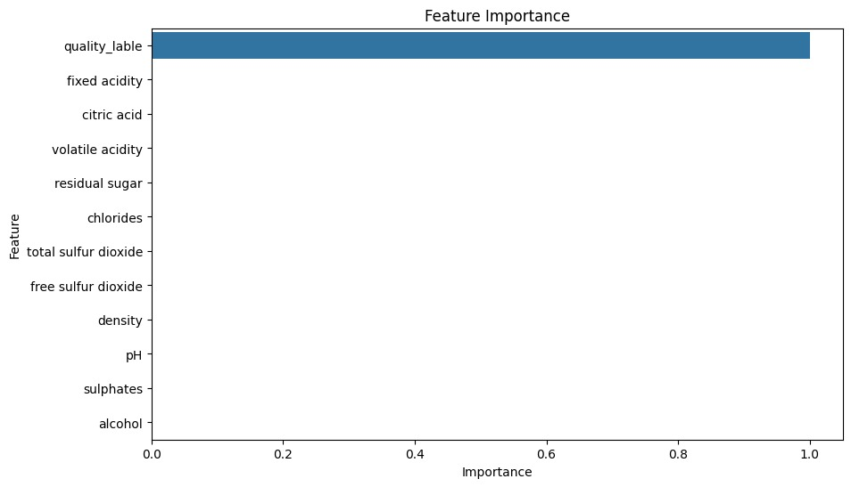

# 🍷 Wine Quality Prediction using Machine Learning

## 📌 Project Overview

This project predicts whether a wine is **Good** or **Bad** using Machine Learning classification algorithms.

The dataset contains physicochemical properties of red wine such as acidity, alcohol content, pH, density, sulphates, and more.

### Quality Label Conversion

- **Good Wine (1):** Quality ≥ 7
- **Bad Wine (0):** Quality < 7

---

## 📂 Dataset

The project uses the Wine Quality Dataset containing the following features:

- Fixed Acidity
- Volatile Acidity
- Citric Acid
- Residual Sugar
- Chlorides
- Free Sulfur Dioxide
- Total Sulfur Dioxide
- Density
- pH
- Sulphates
- Alcohol
- quality

### Target Variable

- **quality_label** (0 = Bad, 1 = Good)

---

## 🛠️ Technologies Used

- Python
- Pandas
- NumPy
- Matplotlib
- Seaborn
- Scikit-Learn

---

## 📊 Project Workflow

1. Data Loading
2. Exploratory Data Analysis (EDA)
3. Missing Value Analysis
4. Correlation Analysis
5. Feature Engineering
6. Train-Test Split
7. Logistic Regression (Without Scaling)
8. Logistic Regression (With Scaling)
9. Model Comparison
10. Hyperparameter Tuning using GridSearchCV
11. Feature Importance Analysis

---

## 🤖 Machine Learning Models Implemented

- Logistic Regression
- K-Nearest Neighbors (KNN)
- Decision Tree Classifier

---

## 📈 Evaluation Metrics

The models were evaluated using:

- Accuracy
- Precision
- Recall
- F1 Score
- Confusion Matrix

---

## 📷 Visualizations

### Correlation Heatmap



### Feature Importance



---

## 🏆 Results

The best-performing model was selected after comparing all algorithms and applying hyperparameter tuning using GridSearchCV.

---

## 📁 Project Structure

```text
Wine-Quality-Prediction/
│
├── data/
│   └── winequality-red.csv
│
├── notebooks/
│   └── Wine_Quality_Prediction.ipynb
│
├── images/
│   ├── correlation_heatmap.png
│   └── feature_importance.png
│
├── requirements.txt
├── README.md
└── .gitignore
```

---

## 🚀 How to Run the Project

### 1. Clone the Repository

```bash
git clone https://github.com/Apxsingh/Wine-Quality-Prediction-using-Machine-Learning.git
```

### 2. Move into Project Directory

```bash
cd Wine-Quality-Prediction
```

### 3. Install Required Libraries

```bash
pip install -r requirements.txt
```

### 4. Launch Jupyter Notebook

```bash
jupyter notebook
```

### 5. Open and Run

```text
Wine_Quality_Prediction.ipynb
```

---

## 📋 Requirements

```text
pandas
numpy
matplotlib
seaborn
scikit-learn
```

---

## 👨‍💻 Author

**Arpit Singh Tomar**

GitHub: https://github.com/Apxsingh

---

## ⭐ Support

If you found this project useful, consider giving it a ⭐ on GitHub.